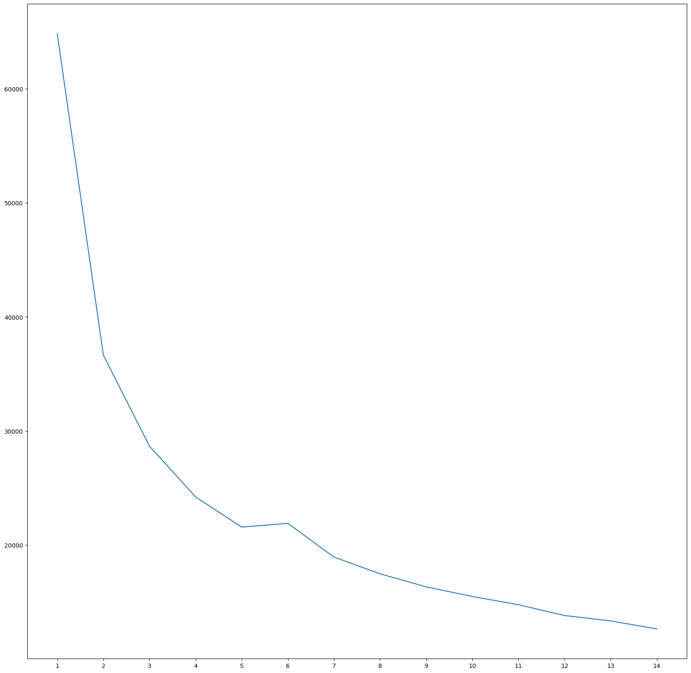

# k_league_tier
## K리그 득점 데이터 기반 포워드 티어

### 프로젝트 배경
- 아무리 포워드라도 골 수 하나만으로 평가하기엔 부족하다고 느낌
- 이적시장때 내가 응원하는 팀이 얼마나 좋은 선수를 샀는지 바로 파악하기 힘들다
- 그래서 여러 데이터를 기반으로 선수를 평가하는 서비스를 기획
- 이를 이용하면 선수의 능력치를 직관적으로 볼 수 있고, 내가 응원하는 팀 이적 현황을 파악하는데도 좋을 것이라 예상함

### 사용시 필요한 라이브러리
streamlit
xgboost
pickle
pandas
os

### 사용법
- xgb_tier.model과 app.py를 한 폴더에 다운
- app.py를 실행할 때 터미널창에 streamlit run app.py를 입력

### 진행 과정
- 티어를 매기기 위해서 우선 분류할 필요가 있음
- 데이터는 k리그 데이터포털에서 크롤링해 옴
- 데이터를 합친 후 굳이 필요하지 않은 열은 삭제
- 이렇게 새로 만든 데이터를 KMeans를 사용해 분류 후 타겟 생성
  - 분류 개수는 분류 시각화를 통해 확인 후 진행
  
- xgboost를 사용해 예측 모델 만듦
- 분류 결과를 확인하면서 티어를 매김
- 배포